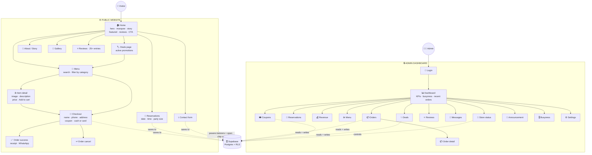
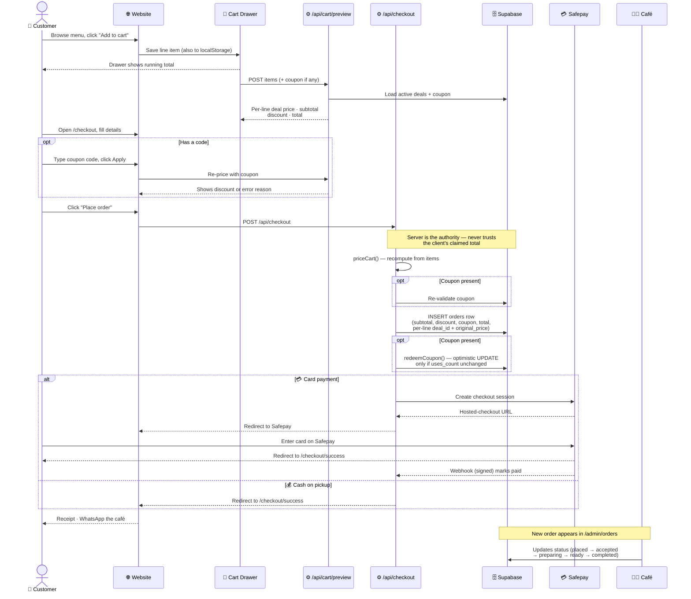
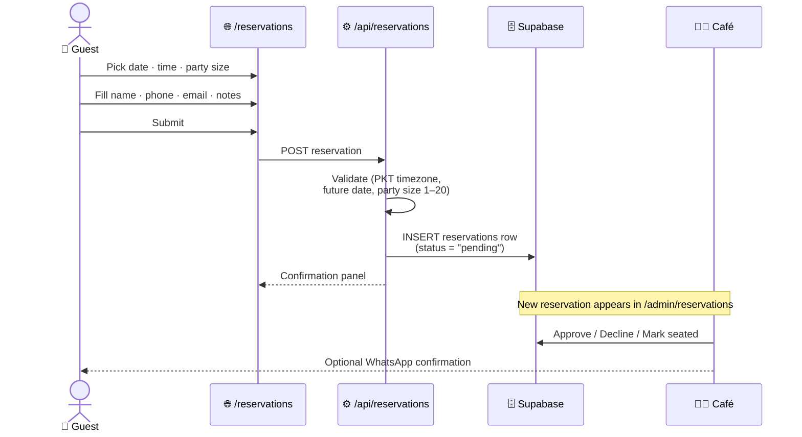
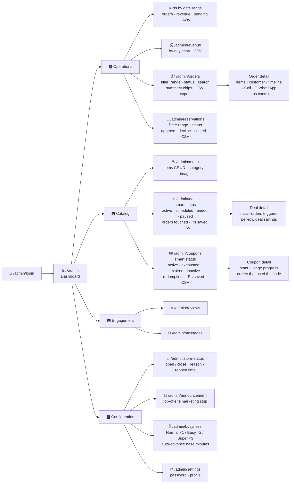
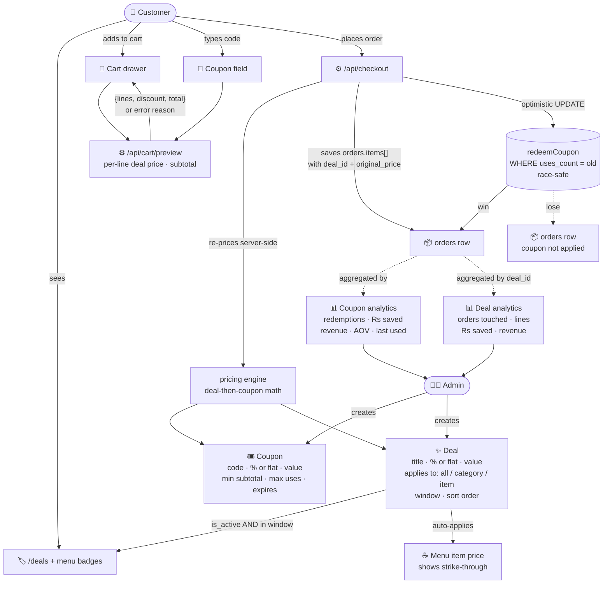
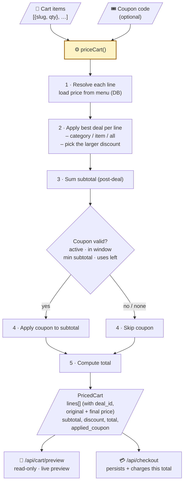
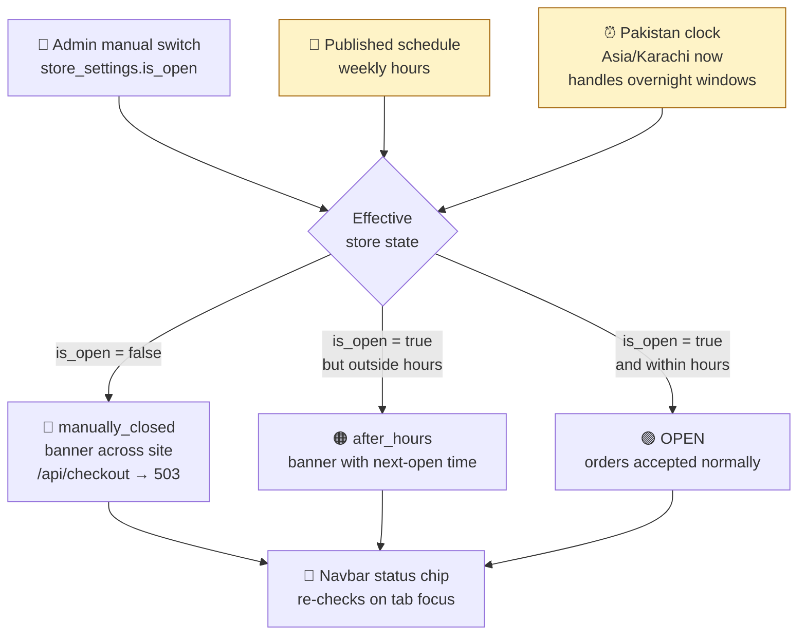
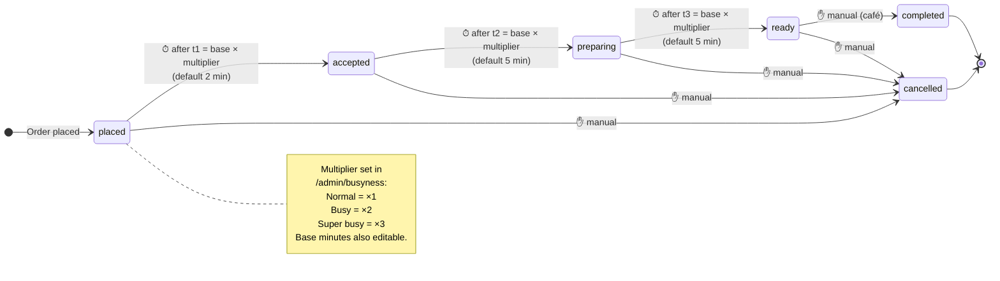
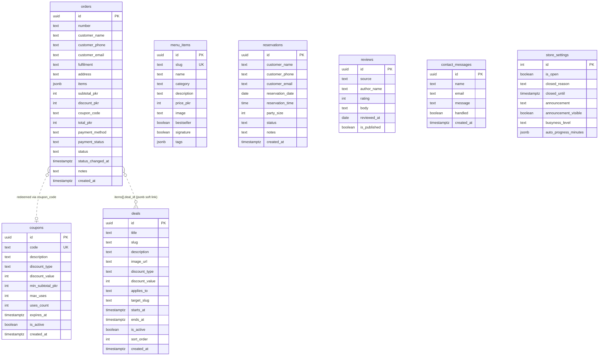

# Meseta Coffee — Site Flow Diagrams

A complete pictorial walkthrough of the website for explaining to the client. Every block below is a self-contained **Mermaid** diagram. Open https://mermaid.live, paste **one block at a time** (the lines between the ```` ```mermaid ```` fences only — not the fences themselves), and the rendered diagram appears on the right.

Use the heading above each block as the title when you talk through it.

---

## Table of contents

1. [The big picture — public site + admin](#1-the-big-picture--public-site--admin)
2. [Customer order journey — step by step](#2-customer-order-journey--step-by-step)
3. [Reservation flow](#3-reservation-flow)
4. [What the admin can do](#4-what-the-admin-can-do)
5. [Deals + coupons lifecycle](#5-deals--coupons-lifecycle)
6. [Pricing engine — server is the authority](#6-pricing-engine--server-is-the-authority)
7. [How "Open / Closed" is decided](#7-how-open--closed-is-decided)
8. [Busyness — automatic order progression](#8-busyness--automatic-order-progression)
9. [Database tables and relationships](#9-database-tables-and-relationships)
10. [Hosting + deployment pipeline](#10-hosting--deployment-pipeline)

---

## 1. The big picture — public site + admin

Everything a visitor or the admin can reach, on one map. The public site is on the left; the admin dashboard is on the right.



---

## 2. Customer order journey — step by step

Exactly what happens from the moment a visitor adds something to the cart to the moment the café is notified.



---

## 3. Reservation flow

Booking a table is simpler than ordering: no payment, no cart, just a server-validated form.



---

## 4. What the admin can do

Every screen the admin can reach, grouped by purpose. Each leaf is one page in the dashboard.



---

## 5. Deals + coupons lifecycle

How a marketing campaign goes from an idea in the admin head to a discount on a customer's order — and how every redemption flows back into the dashboard.



---

## 6. Pricing engine — server is the authority

The same code (`src/lib/pricing.ts`) powers both the cart preview and the real checkout, so what the customer sees and what they pay are always equal — and the client can never inflate or skip a discount.



---

## 7. How "Open / Closed" is decided

Three signals combine to decide whether the store accepts orders right now.



---

## 8. Busyness — automatic order progression

The admin sets a busyness level (Normal / Busy / Super busy) which multiplies the auto-advance timers. New orders crawl forward through the pipeline by themselves; completion and cancellation are always manual. Advancement happens lazily on every list read, so there is no cron job to babysit.



---

## 9. Database tables and relationships

The Supabase schema. Each box is a table; arrows mark foreign keys / soft links.



---

## 10. Hosting + deployment pipeline

What happens between a `git push` and the live site updating.

```mermaid
flowchart LR
    Dev([👨‍💻 Developer]) -->|git push to main| GH[🐙 GitHub repository]
    GH -->|webhook| Host[☁️ Vercel / Netlify<br/>build + deploy]
    Host --> CDN[🌍 Edge CDN<br/>global delivery]

    Visitor([🧑 Visitor]) -->|HTTPS| CDN
    AdminU([🧑‍🍳 Admin]) -->|HTTPS| CDN

    Host -. environment vars .-> Cfg[🔐 .env values<br/>Supabase URL + anon key<br/>service-role key (server only)<br/>Safepay keys · admin secrets]

    CDN <-->|server requests| Fns[⚙️ Server functions<br/>Next.js route handlers<br/>+ server actions]
    Fns -->|service-role key<br/>no-store fetch| SB[(🗄️ Supabase<br/>Postgres + RLS)]
    Fns -->|create checkout / redirect| SP[💳 Safepay<br/>hosted checkout]

    Visitor -.->|complete payment| SP
    SP -.->|signed webhook<br/>marks paid| Fns
    SP -.->|redirect back| CDN

    Visitor -. WhatsApp deep-link .-> WA[💬 WhatsApp<br/>café's number]
    AdminU -. order-detail WhatsApp button .-> WA
```

---

## How to present these to the client

1. **Open** https://mermaid.live in your browser.
2. **Open** this file (`SITE-FLOW.md`) in any text viewer.
3. For each section in turn:
   - Copy the lines between the ```` ```mermaid ```` and ```` ``` ```` fences.
   - Paste into the Mermaid Live editor's left panel.
   - The diagram renders instantly on the right.
   - Walk the client through it using the short paragraph above the block as your script.
4. Mermaid Live has an **Export → PNG / SVG** button if you want to save each diagram as an image for a slide deck.

> 💡 Tip — diagrams 1, 4, and 9 are the most impressive for a non-technical client. Lead with those, then drill into the order journey (diagram 2) and the deals/coupons flow (diagram 5) if they want to go deeper. Diagram 6 (pricing engine) is the one to use whenever the client asks "can a customer hack the price?" — the answer is no, and that picture shows why.
